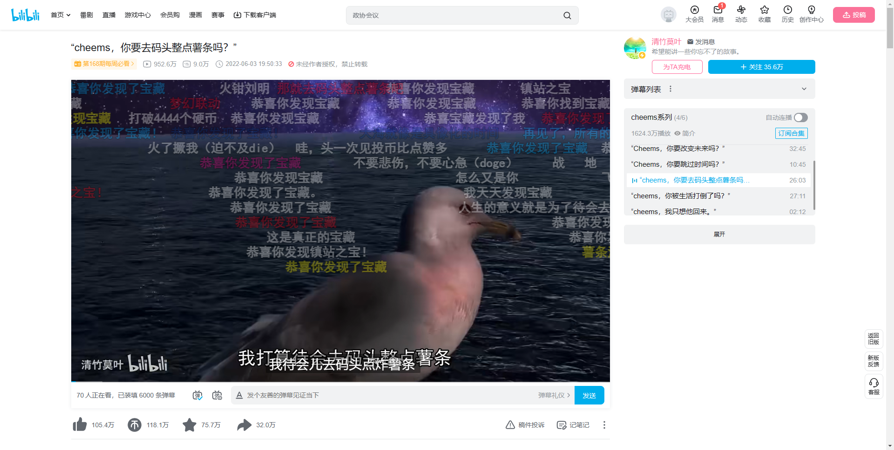
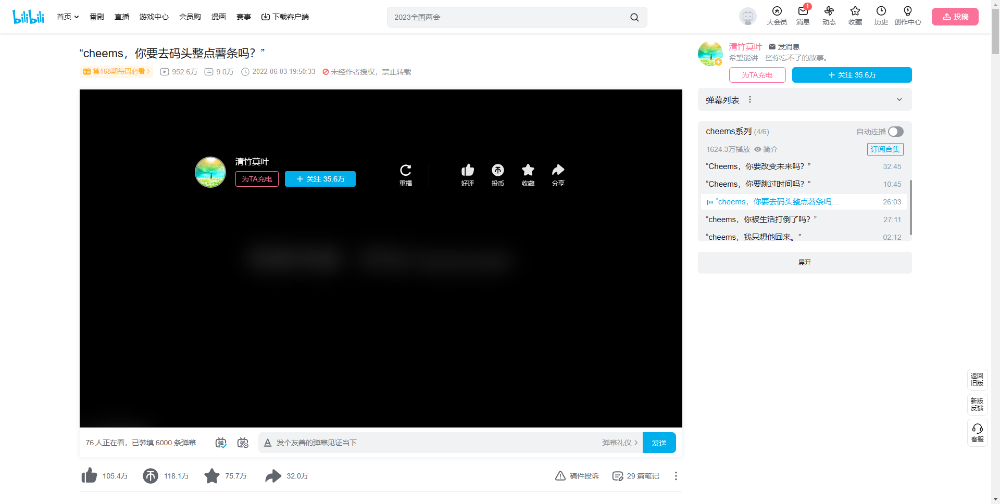
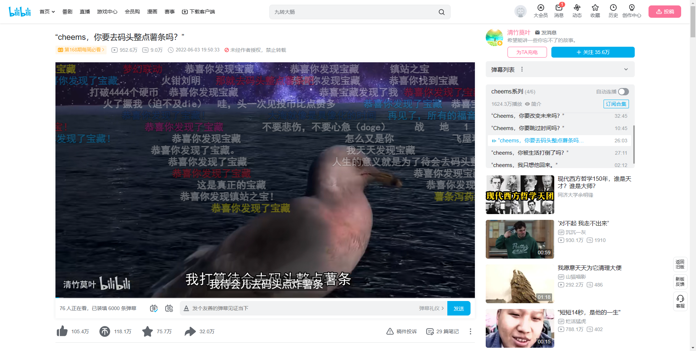
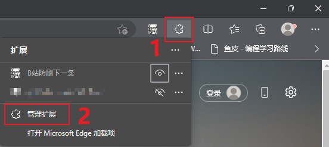
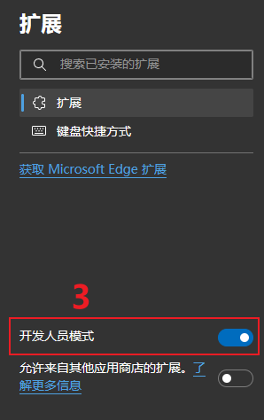
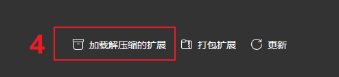
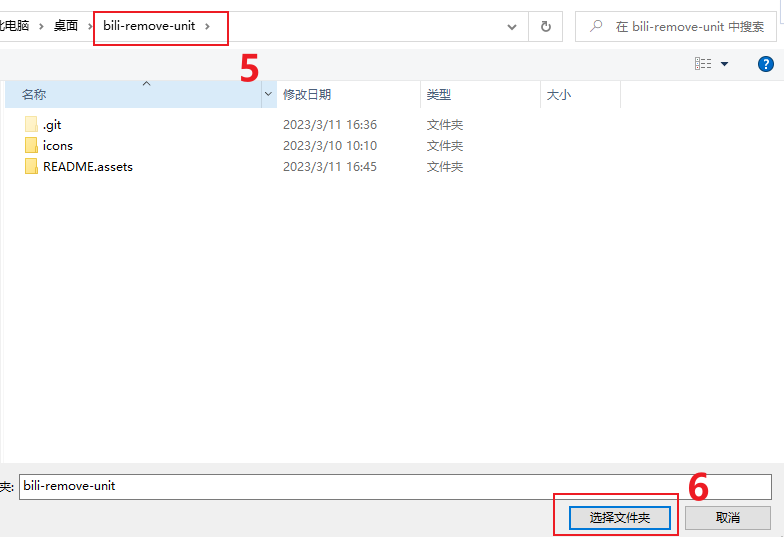
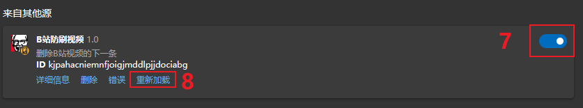
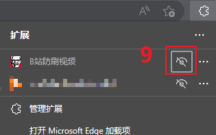

# BILI-RMU

bili-remove-unit 是一款浏览器插件，用于清除B站的视频播放页的所有下一条相关信息，让你不再掉落一刷到底的深渊 😫。

## 效果

开启插件后

开启插件前

## 使用方法

### Microsoft Edge

1. 下载源码到电脑的任意位置，解压好。
2. 打开Edge的插件管理页面
3. 打开 开发人员模式
4. 加载解压缩的扩展
5. 选择程序根路径
6. 打开插件(代码更新时记得点重新加载)
7. 点击解开眼睛后就可以在工具栏看到这个插件了(不解开也能用，只是不显示在工具栏上方)

